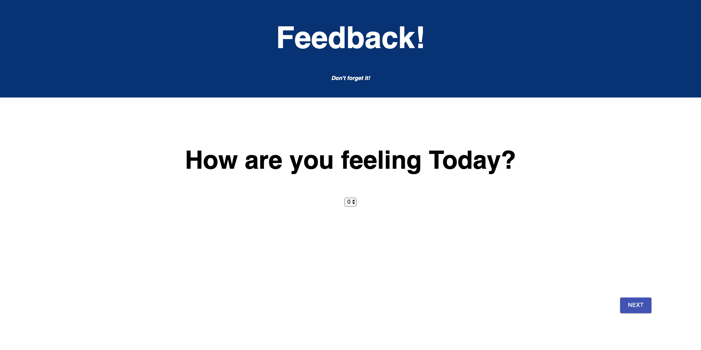
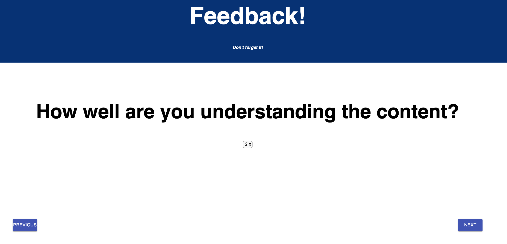
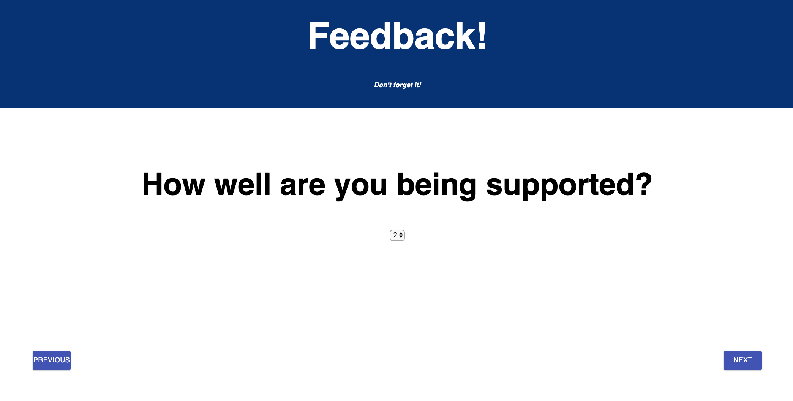
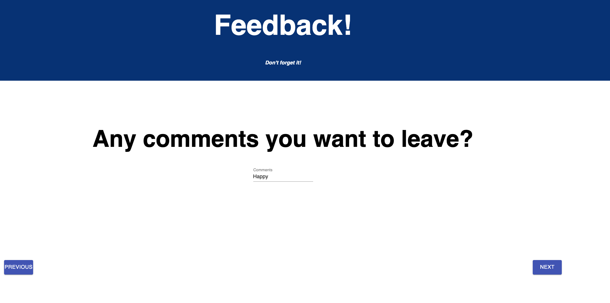
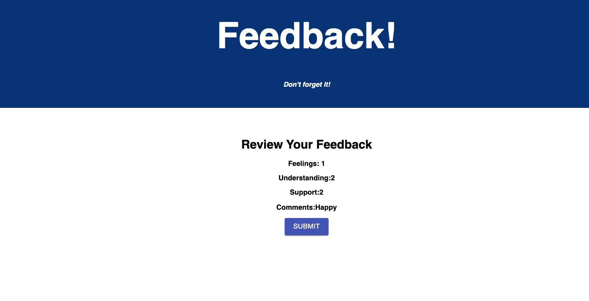
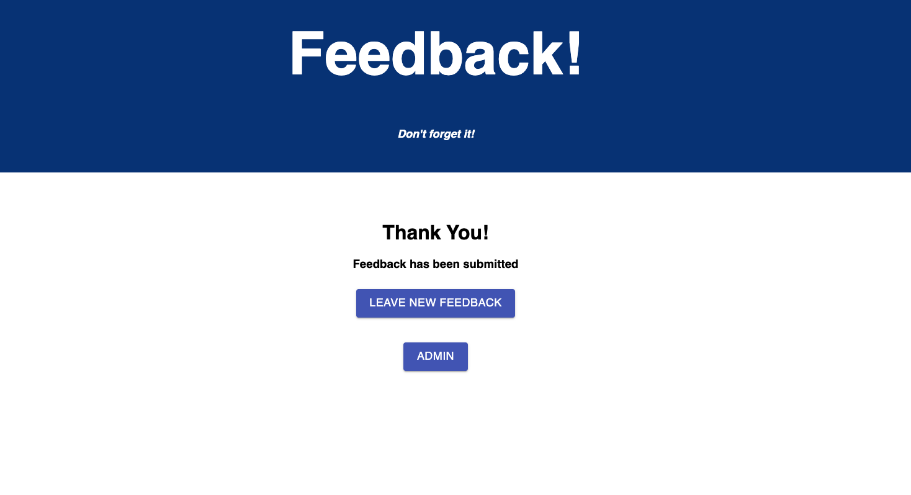
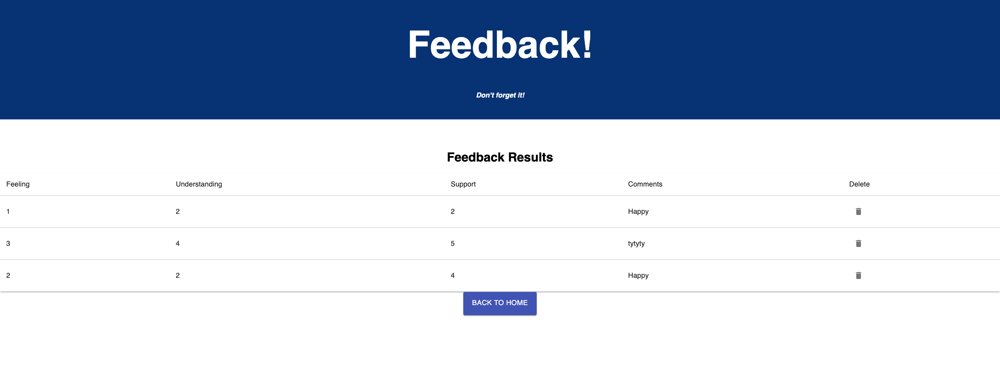

# Project Name

Redux Feedback Loop

## Description

Redux Feedback Loop is a feedback application. It allows users to submit their feedback and display the values.

## Technologies

Technologies used to build this:
-  Node.js
-  Axios
-  Express 
-  React
-  Redux

## Getting Started

## Prerequisites

Before getting started, the following software have been installed on the computer

-  Node.js
-  Axios
-  Express 
-  React
-  Redux

### Check List

### Base Mode:
- [x] Create database and tables
- [x] install npm
      - [x] run server
      - [x] run client
- [x] install redux
    - [x] setup the base for Redux
- [x] create components
- [x] Import Routers
    - [x] create a Next button 
    - [x] link to the next components
- [x] Create review component
    - [x] submit button
- [x] Send feedback to the server
- [x] save the submission in database
- [x] create submission success page
    - [x] create a link to take a new survey
    - [x] Reset the old values

### Stretch Mode:
 
 - [x] Update scores
 - [x] Styling using Material-UI
 - [x] Created Admin Component
   - [x] map data from server and render to dom
   - [x] Add a delete button on click to delete the feedback selected and update database

### Wireframes:

- feeling

- understanding

- support

- comments

- review

- confirmation

- Admin 

